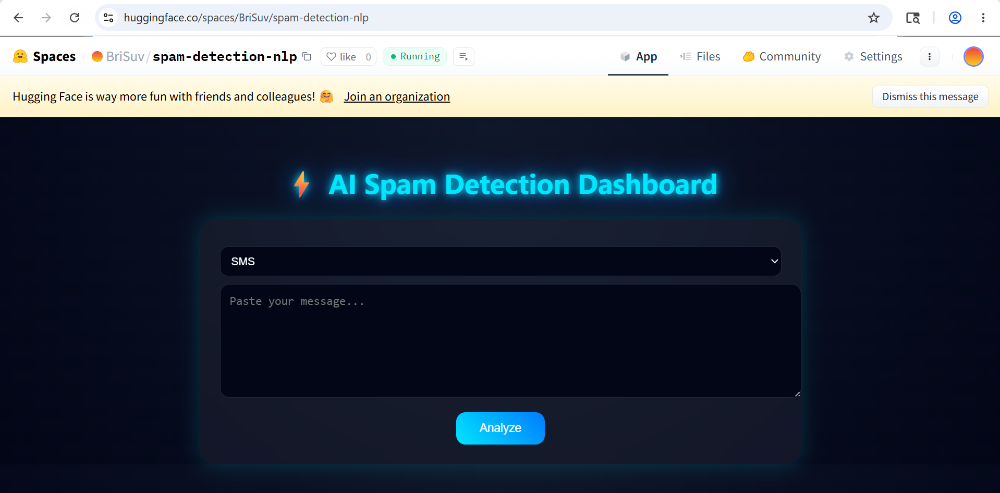
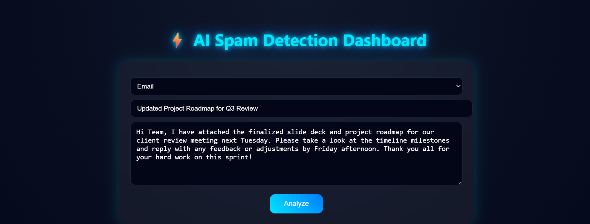
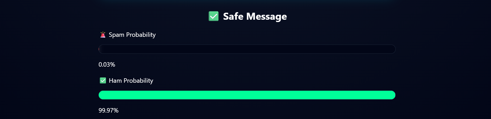
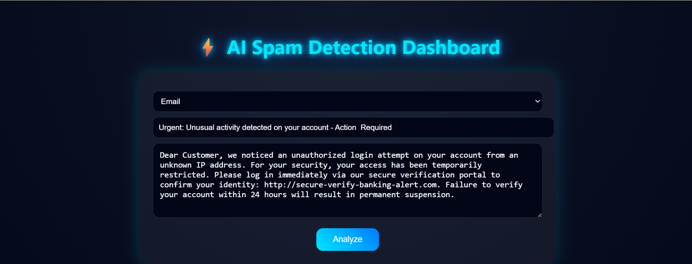
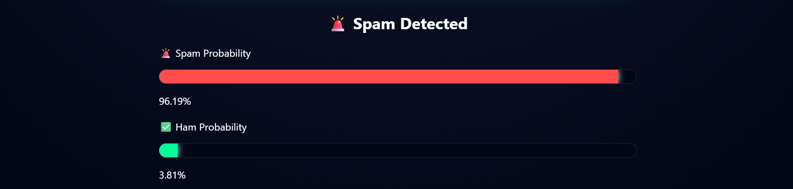
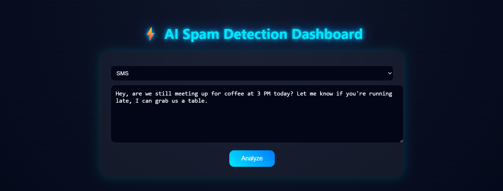
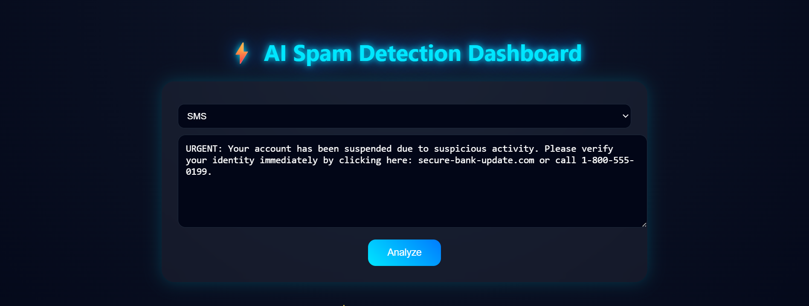

# Spam Detection using Hybrid NLP Model

> A cross-domain spam detection system combining BERT embeddings, handcrafted metadata features, and XGBoost — trained and evaluated on a unified SMS + Email dataset.

---

## Project Overview

This project builds a **production-ready spam classifier** that works across both **SMS** and **Email** messages. Rather than relying solely on keyword-based TF-IDF features, this system introduces a **Hybrid Feature Model** that fuses:

-  **Semantic text embeddings** via `all-MiniLM-L6-v2` (Sentence-BERT)
-  **Handcrafted metadata features** (message length, digit count, currency symbols, URLs, urgency words, etc.)
-  **Cross-domain source encoding** (SMS vs. Email as a signal)

A Flask web application wraps the trained model, enabling real-time predictions.

---

## Project Structure

```
spam-detection-nlp/
│
├── data/
│   ├── processed/
│   │   ├── cleaned_spam_dataset.csv
│   │   └── combined_spam_dataset.csv
│   └── raw/
│       ├── enron_email/
│       │   └── spam_ham_dataset.csv
│       └── sms/
│           └── SMSSpamCollection
│
├── notebooks/
│   ├── 01_data_preparation.ipynb
│   ├── 02_eda_analysis.ipynb
│   ├── 03_preprocessing.ipynb
│   └── 04_model_training.ipynb
│
├── reports/
│   └── results/
│       ├── text_embeddings.npy
│       └── results.md
│
├── spam-web-app/
│   ├── model/
│   │   ├── hybrid_model.pkl
│   │   └── scaler.pkl
│   ├── static/
│   │   └── style.css
│   ├── templates/
│   │   └── index.html
│   └── app.py
│
├── .gitignore
├── README.md
└── requirements.txt
```

---

## Dataset

| Property       | Details                     |
|----------------|-----------------------------|
| Total Samples  | 10,052                      |
| Ham (Not Spam) | 7,948 (79%)                 |
| Spam           | 2,104 (21%)                 |
| Sources        | SMS: 5,158 · Email: 4,894   |

The dataset is a **unified cross-domain corpus** combining SMS and email messages, labeled `0` (Ham) or `1` (Spam).

---

## Feature Engineering

### 1. Text Embeddings (BERT)
Semantic sentence-level embeddings using `SentenceTransformer('all-MiniLM-L6-v2')` — capturing meaning beyond surface-level keywords.

### 2. Handcrafted Metadata Features

| Feature           | Description                                      |
|-------------------|--------------------------------------------------|
| `length`          | Character count of message                       |
| `num_digits`      | Count of digit characters                        |
| `num_upper`       | Count of uppercase characters                    |
| `num_special`     | Count of special characters                      |
| `num_urls`        | Number of URLs detected                          |
| `num_words`       | Total word count                                 |
| `has_link`        | Binary: contains `http` or `www`                 |
| `has_currency`    | Binary: contains `₹`, `$`, `£`, or `€`          |
| `has_urgent_words`| Binary: contains words like `free`, `win`, `urgent` |
| `caps_ratio`      | Ratio of uppercase characters to total           |
| `source_encoded`  | Binary: `0` = SMS, `1` = Email                   |

### 3. TF-IDF Baseline
A `TfidfVectorizer` with 5,000 features and bigram support (`ngram_range=(1,2)`) serves as the classical NLP baseline for comparison.

---

## Experiments & Results

Four classifiers were evaluated across four feature configurations:

| Feature Set      | Best Model          | F1 Score |
|------------------|---------------------|----------|
| TF-IDF Baseline  | XGBoost             | **0.9372**|
| Text Only (BERT) | SVM                 | 0.8961   |
| Metadata Only    | XGBoost             | 0.7886   |
| **Hybrid Model** | **XGBoost**         | **0.9320**|

### Confusion Matrix — Best Baseline (TF-IDF + XGBoost)
-  True Ham: 1588 |  False Positive (Ham→Spam): 22
-  True Spam: 373 |  False Negative (Spam→Ham): 28

### Confusion Matrix — Hybrid Model (BERT + Metadata + XGBoost)
-  True Ham: 1587 |  False Positive: 23
-  True Spam: 370 |  False Negative: 31

> The Hybrid Model achieves **comparable accuracy to TF-IDF** while being semantically richer and more generalizable to unseen message styles.

---

##  SHAP Explainability

SHAP (SHapley Additive exPlanations) values were computed on the Hybrid XGBoost model to interpret feature contributions:

- **`source_encoded`** was the single most impactful feature — email messages exhibit distinctly different spam patterns than SMS
- **`num_digits`** and **`has_currency`** were strong positive spam indicators
- Multiple **BERT dimensions** (e.g., `bert_73`, `bert_127`) contributed nuanced semantic signals
- **`has_link`** and **`has_urgent_words`** confirmed expected behavioral patterns

---

## Error Analysis

### False Positives (Ham misclassified as Spam)
- Legitimate promotional emails from recognized brands (Expedia, CDNow) were flagged due to having URLs, currency symbols, and urgency-like language
- Casual SMS messages with phone numbers or special characters triggered spam signals

### False Negatives (Spam misclassified as Ham)
- Academic-looking spam (fake journal invitations) with formal tone evaded detection
- Degree/diploma scam emails with encoded obfuscation bypassed features
- Very short spam messages lacked enough signal for the model

---

## Web Application (Flask)

The trained hybrid model is deployed as a Flask web app with a browser-based UI — no API calls needed.

### Running the App

```bash
cd spam-web-app
pip install -r requirements.txt
python app.py
```

Then open your browser and go to:
```
http://localhost:5000
```

You'll see a form where you can type your message and get an instant prediction.

---

### How to Use

**For SMS:**
- Select type: `SMS`
- Paste or type your message
- Click **Predict**

**For Email:**
- Select type: `Email`
- Enter the subject line
- Enter the message body
- Click **Predict**

---

### 🧪 Sample Test Inputs

| Type  | Input | Expected |
|-------|-------|----------|
| SMS   | `Hey, are you coming for lunch today?` | Ham |
| SMS   | `Congratulations! You've won a FREE iPhone. Click here to claim your prize!` | Spam |
| Email | Subject: `Meeting Tomorrow` · Body: `Hi, confirming our 10am meeting.` | Ham |
| Email | Subject: `Exclusive Offer` · Body: `You have been selected to receive $1000. Claim at www.prize.com` | Spam |

---

### Screenshots

### Home Screen


### Email Ham Input


### Email Ham Result


### Email Spam Input


### Email Spam Result


### SMS Ham Input


### SMS Ham Result


### SMS Spam Input


### SMS Spam Result


---

### How It Works Internally

When you click Predict, the app:

1. Takes your message (+ subject if email)
2. Combines subject + body for email input
3. Cleans the text (lowercases, removes URLs/digits/punctuation)
4. Generates BERT embeddings via `all-MiniLM-L6-v2`
5. Extracts 11 metadata features (length, digits, caps, URLs, currency symbols, etc.)
6. Scales metadata with the saved `StandardScaler`
7. Concatenates embeddings + metadata → feeds into XGBoost
8. Returns `label`, `spam_confidence`, and `ham_confidence`

**Response format (under the hood):**
```json
{
  "label": "Spam",
  "spam_confidence": 97.43,
  "ham_confidence": 2.57,
  "type": "sms"
}
```

---

## Tech Stack

| Category         | Tools / Libraries                                      |
|------------------|--------------------------------------------------------|
| Language         | Python 3.x                                             |
| ML Framework     | scikit-learn, XGBoost                                  |
| NLP / Embeddings | SentenceTransformers (`all-MiniLM-L6-v2`), TF-IDF     |
| Explainability   | SHAP                                                   |
| Web Framework    | Flask                                                  |
| Visualization    | Matplotlib, Seaborn                                    |
| Serialization    | Pickle                                                 |

---

## Setup & Installation

```bash
# Clone the repo
git clone https://github.com/your-username/spam-detection-nlp.git
cd spam-detection-nlp

# Install dependencies
pip install pandas numpy scikit-learn matplotlib seaborn sentence-transformers xgboost shap flask

# Run the notebook for training
jupyter notebook notebook.ipynb

# Or launch the web app directly (requires trained model files)
cd spam-web-app
python app.py
```

---

## Key Takeaways

1. **TF-IDF remains a strong baseline** — hard to beat with simple models on clean text
2. **Metadata features alone are insufficient** — they improve recall but hurt precision
3. **Hybrid fusion adds robustness** — particularly for cross-domain generalization (SMS + Email)
4. **Source encoding is surprisingly powerful** — email vs. SMS context shifts the prior significantly
5. **SHAP interpretability** validates that the model learns linguistically meaningful signals, not spurious correlations

---

## Author

**Brindha Suvarna R**  
Spam Detection NLP Project — Cross-Domain Hybrid Model

---

##  License

This project is for academic and research purposes.
